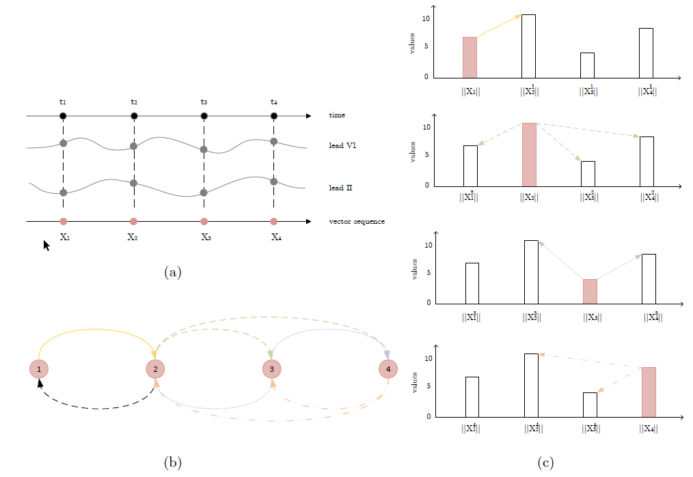
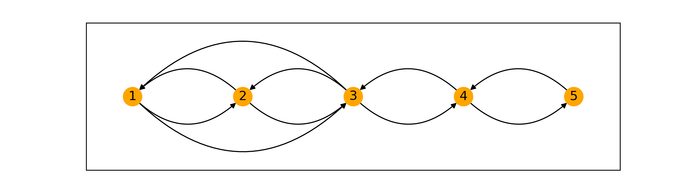

# Contents

- [ts2vvg](#ts2vvg)
- [Vector Visibility Graph](#vector-visibility-graph)
- [Installation](#installation)
- [Running example](#running-example)
- [Usage in real projects:](#usage-in-real-projects)
- [References](#references)


# ts2vvg

ts2vvg: a Python package with an implementation of the Vector Visibility Graph (VVG) [(REN and JIN, 2019)](https://link.springer.com/article/10.1007/s11071-019-05147-7), to convert multivariate time series into graphs. 

Author: Rafael Oliveira. 

Last updated: 2024.02.29.

If you use this package, please cite the following paper:

Oliveira, R. F., Moreira, G. J. P., Freitas, V. L. S., and Luz, E. J. S. Leveraging Visibility Graphs for Enhanced Arrhythmia Classification with Graph Convolutional Networks, arXiv e-prints, 2024. doi:10.48550/arXiv.2404.15367.

# Vector Visibility Graph

  
The VVG is based on the [Visibiility Graph (VG)](https://www.pnas.org/doi/abs/10.1073/pnas.0709247105), available in the well-known package [ts2vg](https://pypi.org/project/ts2vg/). We propose here an implementation for VVG, using numpy and networkX libraries. Find below an illustration of how the algorithm works, from an input multivariate time series to the resulting directed network.



Source: Adapted from (REN and JIN, 2019).

# Installation

To install the ts2vvg package in a Python environment:

```shell
pip install git+https://github.com/raffoliveira/ts2vvg@main
```

## Requirements

The required package for ts2vvg is:

+ numpy==1.26.4

To run the example:

+ matplotlib==3.8.3
+ networkx==3.2.1

# Running example

We provide a simple example to demonstrate the conversion of a multivariate time series into a graph. Input data $`X=[\{8,5\}, \{2,1.5\}, \{13,13\}, \{11,9.5\}, \{7,6\}]`$, a 2-dimensional time series of 5 points:

```python
from ts2vvg.graph import build_graph

time_series_1 = [8.0, 2.0, 13.0, 11.0, 7.0]
time_series_2 = [5.0, 1.5, 13.0, 9.5, 6.0]

adj_list = build_graph(series=(time_series_1, time_series_2), time_direction=False)
```

- ```series```: A tuple with the time series;
- ```time_direction```: True if edges are allowed only between time steps $t_a$ to $t_b$, for $t_a < t_b$. False otherwise.

The result is the following graph:



To run the example, open the `example` directory:
```
cd .\example
```

and execute the code below in the terminal:

```
python example.py
```


# Usage in real projects:

- Leveraging Visibility Graphs for Enhanced Arrhythmia Classification [paper](https://arxiv.org/abs/2404.15367) [code](https://github.com/raffoliveira/VG_for_arrhythmia_classification_with_GCN).


# References

Ren, W., Jin, N. Vector visibility graph from multivariate time series: a new method for characterizing nonlinear dynamic behavior in two-phase flow. Nonlinear Dyn 97, 2547–2556 (2019). https://doi.org/10.1007/s11071-019-05147-7
