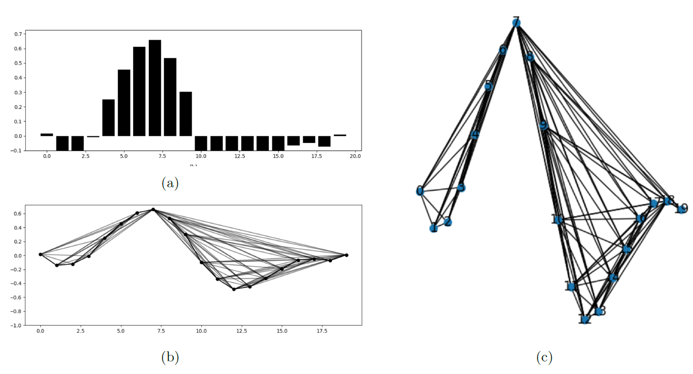

# Visibility Graph e Vector Visibility Graph

# Summary

- [Overview](#overview)
- [Visibility Graph](#visibility-graph)
- [Vector Visibility Graph](#vector-visibility-graph)
- [System Requirements](#system-requirements)
  - [Clone](#clone)
  - [Packages](#packages)
  - [Environments](#environments)
- [Reproduce](#reproduce)
  - [Visibility Graph](#visibility-graph)
  - [Vector Visibility Graph](#vector-visibility-graph)
- [Information](#information)

# Overview

This repository presents the implementation of two methods for converting time series into graphs. This methods were used with Graph Convolutional Networks ([GCN](https://tkipf.github.io/graph-convolutional-networks/)) for arrhythmia classification on my Master's thesis in Computer Science at the Federal University of Ouro Preto. The data used here was [MIT-BIH (The Massachusetts Institute of Technology - Beth Israel Hospital Arrhythmia Database)](https://physionet.org/content/mitdb/1.0.0/).

The code was written by Rafael Oliveira. Last updated: 2024.02.29.

## Visibility Graph


Method proposed by Lacasa et al. in the paper titled "From time series to complex networks: The visibility graph" ([link](https://www.pnas.org/doi/abs/10.1073/pnas.0709247105)). This method converts a one-dimensional time series (ECG signal) into a complex network. For the implementation, the package [ts2vg](https://pypi.org/project/ts2vg/) was used which implements the visibility graph method.




## Vector Visibility Graph

  
Method proposed by Ren and Jin in the paper titled "Vector visibility graph from multivariate time series: a new method for characterizing nonlinear dynamic behavior in two-phase flow" ([link](https://link.springer.com/article/10.1007/s11071-019-05147-7)). This method is based on the VG method but applied to the conversion of multivariate time series into a complex network. As there is no implementation available via a Python package, a custom implementation was used with the help of the numpy and networkX libraries.


# System Requirements


## Clone

```shell
git clone https://github.com/raffoliveira/VG_VVG_implementation_for_ECG_classification.git
```

```shell
cd VG_VVG_implementation_for_ECG_classification
```

## Packages

The main packages are listed below. 

+ dgl==2.0.0
+ igraph==0.11.4
+ matplotlib==3.8.3
+ networkx==3.2.1
+ numpy==1.26.4
+ pandas==2.2.0
+ scipy==1.12.0
+ seaborn==0.13.2
+ torch==2.2.0
+ ts2vg==1.2.3


To install all the packages described in the requirements file using below command.

```shell
pip install -r requirements.txt
```

## Environments

The development version of the packages has undergone testing on Linux. The system and drivers information are listed below.

+ Linux Mint 20.1 
+ CPU AMD Ryzen Threadripper 3960X 24-Core 3.8GHz
+ GPU NVIDIA GeForce RTX 3090
+ CUDA 11.1

# Reproduce

Each method has two examples: a simple example and an example using ECG signals. 

## Visibility graph VG

### Simple example folder

In this folder, a simple example is presented to demonstrate a basic conversion of a time series into a graph. To execute the example, you need to have a file in pickle format called `time_series.pkl` containing the time series, for example, [4, 6.3, 1, 0.2, 4.5]. 

To execute the file, simply run the command below.

```
python example_simple.py
```

### ECG example folder

In this folder, a simple example is provided to illustrate the fundamental process of converting an ECG (Electrocardiogram) signal, a type of time series data, into a graph representation. For this example, an ECG signal from patient number 119 sourced from the MIT-BIH dataset is utilized. It's necessary that the file is located in the directory `Data/MIT_BIH/119.mat`. 

All ECG signals from the MIT-BIH dataset in the `.mat` format can be accessed in my GitHub project  [VG_for_arrhythmia_classification_with_GCN](https://github.com/raffoliveira/VG_for_arrhythmia_classification_with_GCN). 

Given that ECG signals are commonly used in arrhythmia classification, the code follows several steps outlined below:

+ **Segmentation:** The ECG signal is segmented into smaller components known as beats. Each beat comprises a fixed number of points from the ECG signal. In this example, each beat consists of 280 points.
+ **Subsampling:** As certain classes within the MIT-BIH dataset may have more beats than others, this step involves undersampling classes with a high number of beats. If the user prefers to work with all beats, they can simply comment out this step in the code.
+ **Conversion:** In this stage, each beat is converted into a graph using the VG (Visibility Graph) method. Files `.csv` will be created on files directory in this step.
+ **Dataset Creation:** As an illustrative example, this step involves creating a dataset suitable for use with a Graph Convolutional Network (GCN). To accomplish this, the DGL (Deep Graph Library) package is employed. Further information about the DGL package can be found in its documentation here. [here](https://docs.dgl.ai/). The files `.csv` created on files directory is used in this step.
  
To execute the file, simply run the command below.

```
python example_ecg.py
```


## Vector Visibility graph VVG

Similar to the Visibility Graph, two examples are provided here: a simple example and an ECG example. The main difference is in the method used for constructing the visibility graph, which is the Vector Visibility Graph (VVG).

### Simple example folder

In this folder, a straightforward example is provided to illustrate the basic process of converting two time series into a graph. To execute this example, you will need two files in pickle format named `time_series_1.pkl` and `time_series_2.pkl`, containing the respective time series data, such as [5, 8.3, 3, 0.4, 5.5].

The implementation of the code is based on the article titled **Vector visibility graph from multivariate time series: a new method for characterizing nonlinear dynamic behavior in two-phase flow** by Ren Weikai and Jin Ningde. This article can be found [here](https://link.springer.com/article/10.1007/s11071-019-05147-7).

Upon execution, the resulting graph is saved in `.gml` format. However, sharing the graph can be made more convenient.

To run the file, simply execute the command provided below.

```
python example_simple.py
```

### ECG example folder

In this folder, a simple example is provided to illustrate the fundamental process of converting an ECG signal, a type of time series data, into a graph representation. For this example, an ECG signal from patient number 119 sourced from the MIT-BIH dataset is utilized. It's necessary that the file is located in the directory `Data/MIT_BIH/222.mat`.

The same steps described in VG method was used here.

To execute the file, simply run the command below.

```
python example_ecg.py
```

# Information

The implementation described here was utilized in the experiments detailed in the article titled **Leveraging Visibility Graphs for Enhanced Arrhythmia Classification**. Comprehensive information regarding these experiments can be found in my GitHub project [VG_for_arrhythmia_classification_with_GCN](https://github.com/raffoliveira/VG_for_arrhythmia_classification_with_GCN).

